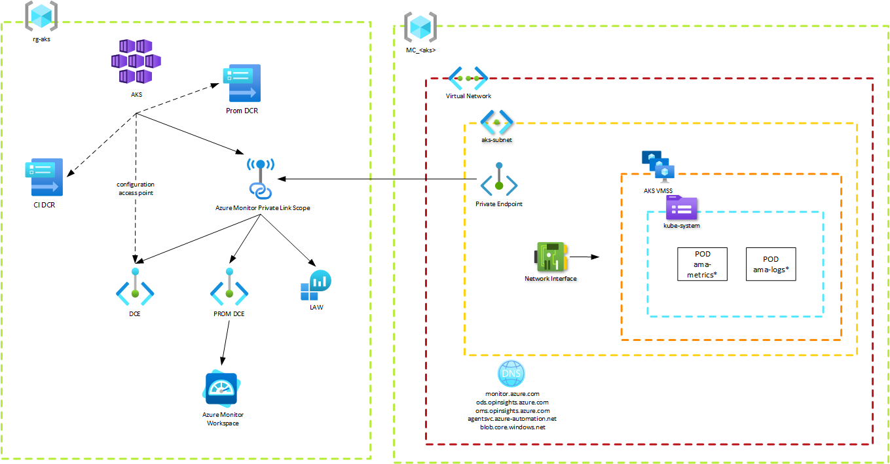

# Azure Kubernetes Service with Network Isolation via Azure Monitor Private Link Scope

This demo deploys an AKS service using AMPLS to maintain private link communication between AKS and the Log Analytics Workspace and Azure Monitor Workspace it sends data to.

The deployment creates the following high-level flow. Container Insights data will flow from the AKS VMSS via the ama-logs pod, to the private end point, ingested via the DCE to the LAW. Managed Prometheus data will flow from the AKS VMSS via the ama-metrics POD, to hte private end poitn, ingested via the PROM DCE and on to the Azure Monitor Workspace.



The most important pieces of this diagram are outlined below.

### General

Managed Prometheus offers [recording rules](https://prometheus.io/docs/prometheus/latest/configuration/recording_rules/) as part of a deployment via the Azure Portal. Those are not included as part of this IaC deployment. However, they may be added in the future.

### RG-AKS Resource Group

For Container Insights, there is a Container Insights DCR, which also contains configurations for syslog. The Container Insights DCR does not require a DCE to be defined within it.

Prometheus uses a differnet DCR and has a DCE defined within it. That DCE is called "PROM DCE" in the diagram above.

The DCR for Container Insights and Prometheus are associated with the AKS service. They are not associated with the VMSS in the node resource group.

The AKS service is also associated with a single DCE as its configuration access point. We could use the PROM DCE for this solution. However, it is easier to manage if we create a DCE specifically for configuration access so as not to use a single DCE for too many purposes.

The AMPLS, DCE, PROM DCE, and LAW all have their network isolation enabled. However, the LAW will accept queries from public networks so we can query the LAW via the Portal on our own machines.

### MC_AKS Resource Group

This resource group is for the AKS nodes.

The Private Endpoint pointing to the Azure Monitor Private Link Scope must be in the same vnet at the network interface for the AKS VMSS or in a VNET the network interface can reach.

The private DNS zones will be linked to the vnet of the PE to allow private network DNS resolution for both Container Insights and Managed Prometheus.

It's important to note that many organizations will have many different methods for organizing their resources. They may choose to put their vnet in a different resource group, their PEs in a different subnet, or use a custom DNS solution. These items are not accounted for, but the code should be easily modifiable for anyone's needs.

### MA Resource Group

Managed Prometheus will create a resource group prefixed with "MA_" that contains a DCR and DCE for the purposes for Prometheus remote write. This information is not accounted for in the diagram. If you wish to force network isolation on this endpoint, you would do so on the DCE created within the MA_ resource group.


## Deploy

The commands below will execute the demo. They are intended to run in PowerShell, but easy to modify for bash.

```pwsh
$tenantId = '<tenant-id>'
$subscriptionId = '<subscription-id>'
$resourceGroupName = '<resource-group-name>'
$location = '<location>'
# Principal ID of the individual who should be able to read metrics from the Azure Monitor Workspace
$principalId = '<principal-id-guid>'  
# The AKS node resource group is of the default format MC_<aks-resource-group>_<aks-cluster-name>_<aks-region>. We calculate
# that below based on the inputs used to format the name of the AKS cluster. It's not perfect, but it makes for a single click
# deployment.
$appIdentifier = Get-Content .\shared_variables.json | ConvertFrom-JSON | Select-Object -ExpandProperty appIdentifier
$nodeResourceGroupName = "MC_$($resourceGroupName)_aks-$($appIdentifier)-$($location)"

az login --tenant $tenantId
az account set --subscription $subscriptionId
# Create the resource group to deploy the AKS service to.
az group create --location $location --name $resourceGroupName
# Deploy the AKS service and other services
az deployment group create --name AKSResources --resource-group $resourceGroupName --template-file 01_resources.bicep --parameters principalId=$principalId
# Get the input parameters for the second deployment command
$aksVnetName = az network vnet list --resource-group $nodeResourceGroupName --query [].name -o tsv
$amplsId = az monitor private-link-scope list --resource-group $resourceGroupName --query [].id -o tsv
# Deploy the resources required within the node resource group
az deployment group create --name AKSNodeResources --resource-group $nodeResourceGroupName --template-file 02_node_resources.bicep --parameters vnetName=$aksVnetName amplsId=$amplsId
```

## Access the AKS Cluster

This deployment uses Azure RBAC for AKS. If you wish to access your cluster and investigate anything, run the following commands to make yourself admin on the AKS cluster.

```pwsh

$aadIdentity = '<azure-ad-identity>'
$resourceGroupName = '<resource-group>'
$aksClusterName = '<aks-cluster-name>'

# Get the resource ID of the AKS cluster
$AKS_ID=$(az aks show -g $resourceGroupName -n $aksClusterName --query id -o tsv)

# Assign yourself the AKS cluster admin role. This gives you super dooper user access to the cluster.
az role assignment create --role "Azure Kubernetes Service RBAC Cluster Admin" --assignee $aadIdentity --scope $AKS_ID
```