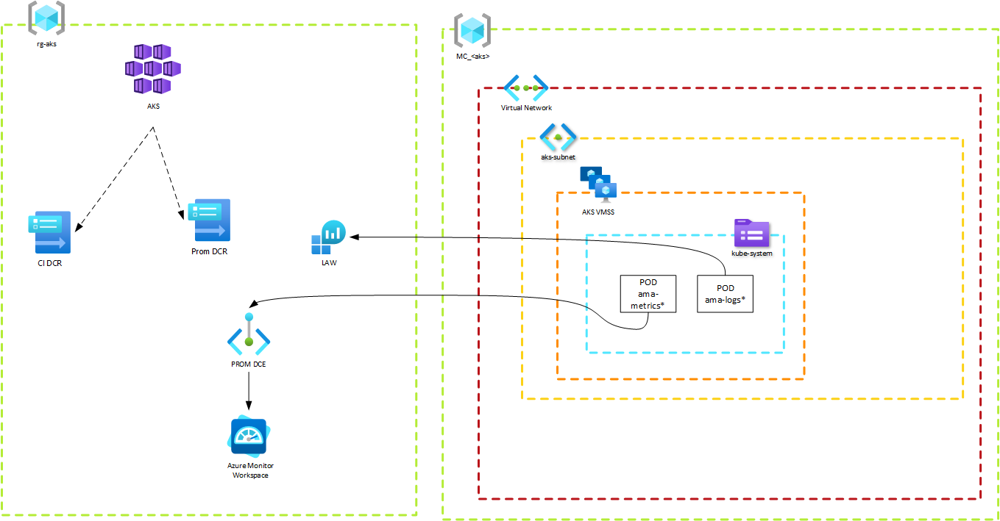

# Azure Kubernetes Container Insights and Managed Prometheus - Public Endpoints

This demo deploys Azure Kubernetes Service and DCRs for Container Insights (and Syslog) and Managed Prometheus via Bicep. The Container Insights DCR sends data to a LAW. Managed Prometheus sends data to an Azure Monitor Workspace. Communications are done over public endpoints. If you need a demo that utilizes network isolation, see the [AKS with Network Isolation demo](../AKS_AMPLS/).

A high-level diagram of the deployment is below.



## Important Details

The Container Insights DCR does not require a DCE. AKS uses one when the data is ingested, but we do not deployment one as part of the bicep files. Instead, public ingestion points are leveraged. 

Managed Prometheus requires a DCE to be defined within its DCR. This is represented in the diagram as "PROM DCE". 

AKS is associated with the Container Insights and Managed Prometheus DCR. It is _not_ associated with the AKS VMSS in the node resource group.

Data for Container Insights flows from the ama-logs PODs to a LAW. Note that Container Insights also sends data to Azure Metrics Explorer, but I did not draw that out in the diagram.

Data for Managed Prometheus flows from the ama-metrics PODs to the PROM DCE and then to the Azure Monitor Workspace.

Azure Monitor Workspace deployments create an additional managed resource group that starts with "MA_" and deploys a DCR and DCE that are intended for use by Prometheus remote write. The diagram does not show this as it is not used by the AKS instance in this demo.

As part of the deployment, you have the ability to add your GUID to the Monitoring Data Reader role within the Azure Monitor Workspace scope. As the resource owner, you are not automatically added to this group. Adding it during deployment is for ease of use.

Managed Prometheus offers [recording rules](https://prometheus.io/docs/prometheus/latest/configuration/recording_rules/) as part of a deployment via the Azure Portal. Those are not included as part of this IaC deployment. However, they may be added in the future.

## Deploy

The commands below will execute the demo. They are intended to run in PowerShell, but easy to modify for bash.

Make sure to set your variables appropriately.

```pwsh
$tenantId = '<tenant-id>'
$subscriptionId = '<subscription-id>'
$resourceGroupName = '<resource-group-name>'
$location = '<location>'
# Unique identifier added to all resources deployed
$appIdentifier = '<appIdentifier>'
# Principal ID of the individual who should be able to read metrics from the Azure Monitor Workspace
$principalId = '<principal-id-guid>'  

az login --tenant $tenantId
az account set --subscription $subscriptionId
# Create the resource group to deploy the AKS service to.
az group create --location $location --name $resourceGroupName
# Deploy the AKS service and other services
az deployment group create --name AKSResources --resource-group $resourceGroupName --template-file 01_resources.bicep --parameters principalId=$principalId appIdentifier=$appIdentifier
```

## Access the AKS Cluster

This deployment uses Azure RBAC for AKS. If you wish to access your cluster and investigate anything, run the following commands to make yourself admin on the AKS cluster.

```pwsh

$aadIdentity = '<azure-ad-identity>'
$resourceGroupName = '<resource-group>'
$aksClusterName = '<aks-cluster-name>'

# Get the resource ID of the AKS cluster
$AKS_ID=$(az aks show -g $resourceGroupName -n $aksClusterName --query id -o tsv)

# Assign yourself the AKS cluster admin role. This gives you super dooper user access to the cluster.
az role assignment create --role "Azure Kubernetes Service RBAC Cluster Admin" --assignee $aadIdentity --scope $AKS_ID
```