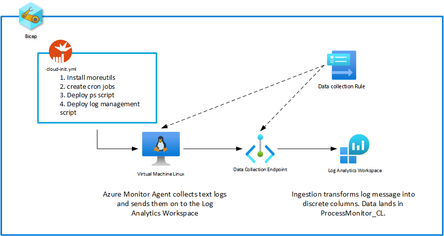
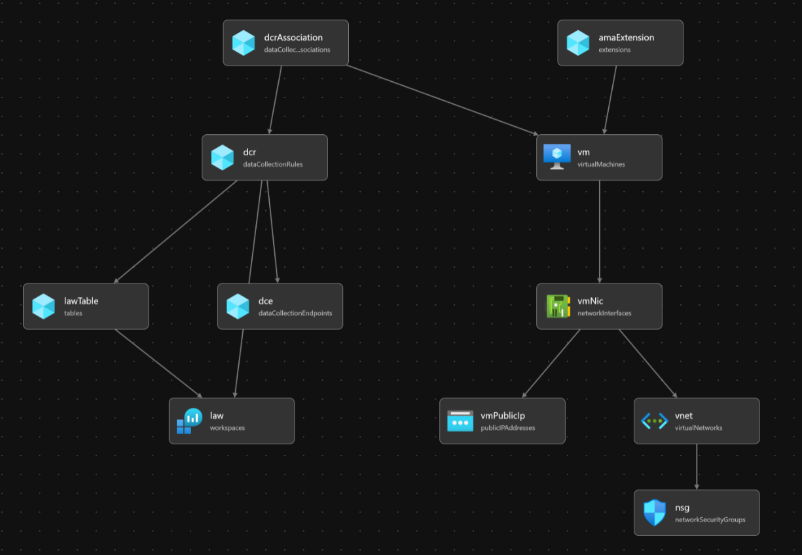
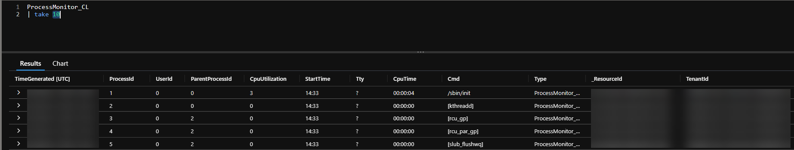

# Process Monitor

Azure Monitor Agent does not provide native support for process monitoring in Linux. However, the ability to gain this information is straight forward. When creating a machine, we can leverage [cloud-init](https://learn.microsoft.com/en-us/azure/virtual-machines/linux/using-cloud-init) to deploy a script that will run the [ps command](https://www.man7.org/linux/man-pages/man1/ps.1.html), write that data to a file, and then acquire that data via Azure Monitor Agent as a custom text log to send on to our destination. The destination is typically a Log Analytics Workspace.

We use this method instead of other options, such as via a script in the [Log Ingestion API](https://learn.microsoft.com/en-us/azure/azure-monitor/logs/logs-ingestion-api-overview), for a few reasons.

1. Writing the log to disk provides temporary caching in the event of a network failure.
2. The target LAW table's _ResourceId field will be populated. This allows us to take advantage of [RBAC](https://learn.microsoft.com/en-us/azure/azure-monitor/logs/manage-access) for democratized monitoring within a central LAW.
3. There's no need to write additional authentication code. Azure Monitor Agent uses [Managed Identities](https://learn.microsoft.com/en-us/azure/active-directory/managed-identities-azure-resources/overview). If we wrote this code using the Log Ingestion API, we could acquire the VM's MSI to send the log data, but we still need to write the code that does authentication. 

We use cloud-init to deploy this work at scale. The cloud-init code can be found in [here](./cloud-init.yml). The code deploys a package, two scripts, and two cron jobs that call the scripts.

__NOTE:__ This code can be used as a pattern for deploying any script to Azure VMs or VMSSs at scale.

## How It Works

If you don't care how this works, and just want to see it in action, go to the [deploy](#deploy) section.

### Architecture

Below is a high-level diagram that shows most of the components. A data collection rule is created to collect the log data from the VM and send that data to the log analytics workspace. The data collection rule contains a Kusto transform that parses the output of the process log created on the VM into discrete fields that map to the custom table created in the Log Analytics Workspace.

The code is deployed via [Bicep](https://learn.microsoft.com/en-us/azure/azure-resource-manager/bicep/overview?tabs=bicep). The [cloud-init.yml](./cloud-init.yml) file is associated with the Bicep code that deploys the VM. The cloud-init.yml file is executed once when the VM is first started. It installs some utilities, creates two scripts, and sets up the cron jobs to run those scripts.



### Bicep Resource Relationship

There are more components than shown in the architecture diagram. Below is a visual of the resource relationship from the VSCode Bicep visualizer.



### Cloud Init

The [cloud-init.yml](./cloud-init.yml) contains all the cloud-init configuration information. It runs the first time the VM starts, deploying the required packages, scripts, and cron jobs.

We first deploy the [moreutils](https://www.putorius.net/moreutils.html) package. This package is used by the process_monitor.sh script to add a timestamp to every line output by the ps command.

Then, the process_monitor cron job is deployed. This job runs the process_monitor.sh and process_log_manager.sh scripts on a set interval. This is where you would change the execution interval.

Next, the process_monitor.sh script is deployed. This script runs the ps command and writes the results to a file. The ps command requests very specific fields. These fields map to columns in the LAW table. Please, see the script for any additional details.

Finally, the process_log_manager.sh script is deployed. This script is run once per month to manage the log file build up through gzip and removing old gzip files. Please, see the script for any additional details.

__NOTE:__ This implementation follows the [best practices recommended for custom log management](https://learn.microsoft.com/en-us/azure/azure-monitor/agents/data-collection-text-log?tabs%253Dportal#prerequisites) with Azure Monitor Agent.

## Deploy

Deployment is handled via the az cli. This deployment will deploy all new resources to a single resource group. It is recommended to create a new resource group the first time you deploy to make sure you understand how the demo works.

Login to Azure

```pwsh
az login
```

Set the correct subscription for the deployment

```pwsh
az account set --subscription <subscription_id>
```

Create the resource group

```pwsh
az group create --location <location> --name <resource_group_name>
```

Open the process_monitor.bicepparam file and populate the required values. Note that very few arguments are required to make the deployment as simple as possible. Resource names are generated within the bicep file based on the parameter values.

Deploy the code with the command below.

```pwsh
az deployment group create --name ProcessMonitor --resource-group <resource_group_name> --template-file process_monitor.bicep --parameters process_monitor.bicepparam
```

Once the deployment completes, it will take 10-15 minutes for the first set of data to load in to the workspace. The table populated is called "ProcessMonitor_CL". You can check for your data by running the following command in the LAW:

```
ProcessMonitor_CL
| take 10
```

