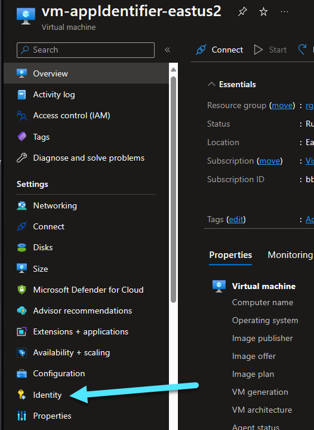
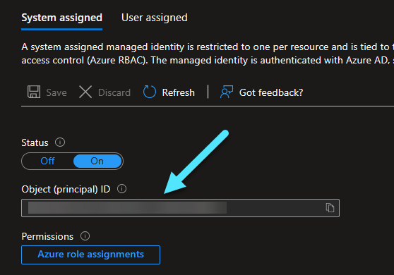
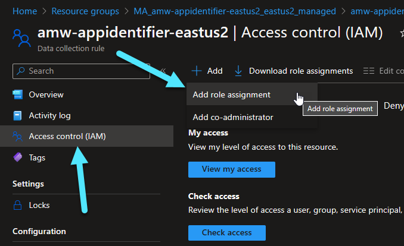
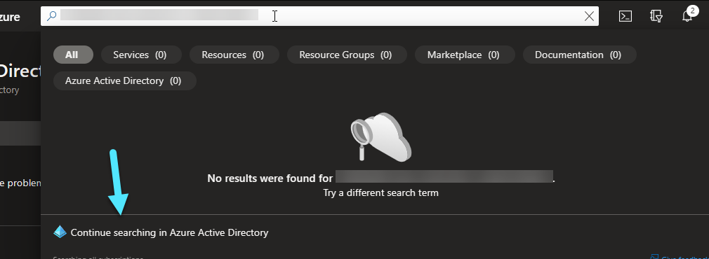
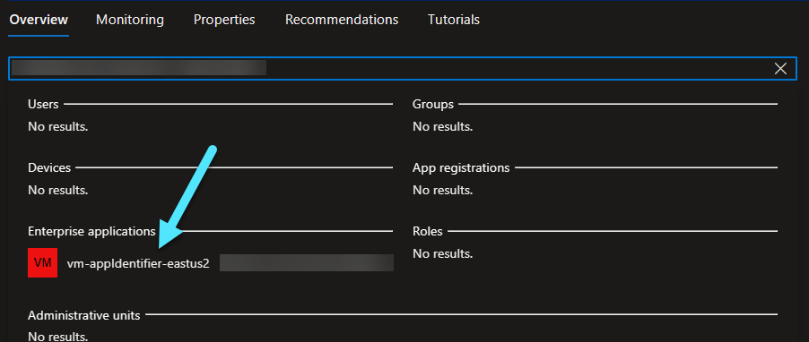
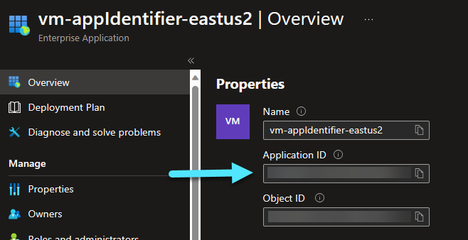
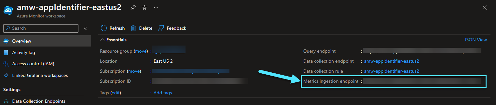
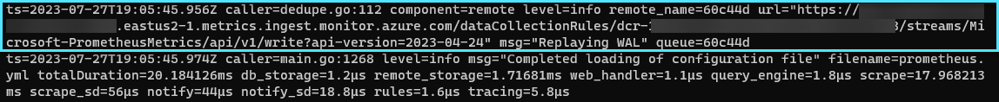
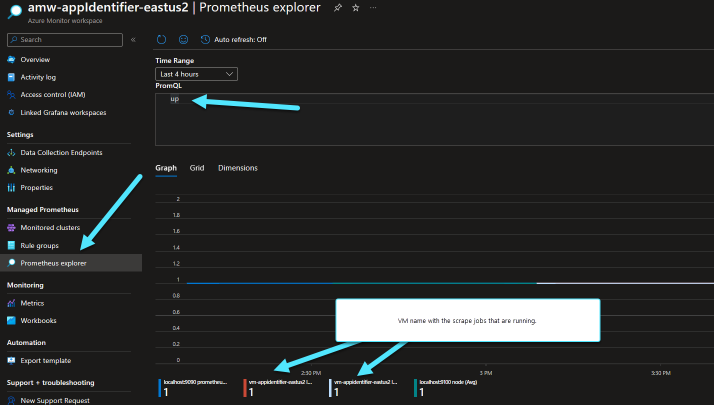

# Use Prometheus OSS to Send Metrics to Azure Managed Prometheus

The demo below shows how to use the [Prometheus OSS](https://prometheus.io/) release to send data to Azure Managed Prometheus using the remote write functionality. This solution will allow you to leverage Prometheus OSS to consume metrics from anywhere and send them to an Azure Managed Prometheus and Managed Grafana instance.

The demo relies on newly added functionality to [Prometheus 2.45.0](https://github.com/prometheus/prometheus/releases/tag/v2.45.0) that enables managed identity authentication within Azure.

__NOTE:__ This demo relies on manually installing Prometheus OSS. This process could be refined, such as automating the deployment, running Prometheus as a service, adding in the Node Exporter for the VM, etc. The purpose of this demo is to provide a baseline for getting Prometheus OSS writing to Azure Managed Prometheus in a way that makes it easy to understand.

## Deployment

Deployment is handled via the az cli and a few manual steps. This deployment will deploy all new resources to a single resource group. It is recommended to create a new resource group the first time you deploy to make sure you understand how the demo works.

Login to Azure

```pwsh
az login
```

Set the correct subscription for the deployment

```pwsh
az account set --subscription <subscription_id>
```

Create the resource group

```pwsh
az group create --location <location> --name <resource_group_name>
```

Deploy the initial infrastructure. This includes the following:

1. Azure Monitor Workspace
2. VNet with a default subnet
3. An NSG associated with the subnet in the item above with an inbound rule on port 22 (SSH)
4. An Ubuntu VM with a NIC in the default subnet
5. A role association of the principal ID parameter to the Monitoring Data Reader role on the Azure Monitor Workspace, to easily query the workspace.

```pwsh
az deployment group create --name Prometheus --resource-group <resource_group_name> --template-file .\prometheus.bicep --parameters-file .\prometheus.bicepparam
```

### Setup Prometheus

This demo relies on the managed identity of your VM. After deploying the infrastructure above, navigate to the newly created VM and select "Identity" from the left side as shown below.



Save the Object ID of the managed identity as it will be needed for the next few steps.



Deploying an Azure Monitor Workspace creates a resource group named "MA_<amw-name>_<region>", where &lt;amw-name> is the name of the Azure Monitor Workspace and &lt;region> is the region of that workspace's deployment. This resource group contains the data collection endpoint and data collection rule intended for remote write. Select the data collection rule from the list of resources in the resource group. Then, select "Access control (IAM)" from the left pane and "Add Role Assignment" from the "Add" drop down at the top of the screen. The image below outlines this.



On the subsequent screens, select the "Monitoring Metrics Publisher" role, select the Managed Identity radio button, and add the managed identity for your VM to the Monitoring Metrics Publisher role. At this point, your managed identity is authorized to send metrics.

#### Get Application ID of Managed Identity

Prometheus relies on the application ID - not the object ID - of the managed identity for authentication and authorization. Within the Portal, paste the Object ID for your managed identity into the search box at the top. Then, select "Continue searching in Azure Active Directory" as shown in the image below.



Your managed identity will appear under "Enterprise applications" as shown in the image below. Select it.



The following screen will show the Application ID. Save this value. It will be used as the identifier for Prometheus authentication.



#### Get the Ingestion URL

Within the Azure Portal, navigate to the Azure Monitor Workspace that was created. On the opening screen, copy the "Metrics ingestion endpoint". This value will be used by Prometheus as the location to remote write metrics to.



SSH into the machine for the next steps.

Download the latest version of Prometheus, decompress it, and navigate into the decompressed folder. The list of Prometheus releases is [here](https://github.com/prometheus/prometheus/releases). You need at least version 2.45.0 for AAD managed identity support.

Below is an example of the commands you would run.

```bash
wget https://github.com/prometheus/prometheus/releases/download/v2.46.0/prometheus-2.46.0.linux-amd64.tar.gz
tar fxvz prometheus-2.46.0.linux-amd64.tar.gz
cd prometheus-2.46.0.linux-amd64
```

Open the prometheus.yml file found in this directory with your favorite text editor.

Modify your file to look like the one below. 

- Replace &lt;vm-name> with the VM's name. The cluster value is an external label associated with the VM that Managed Prometheus and Grafana use to identify the VM. 
- Set the &lt;metrics-ingestion-endpoint> value to the one copied from the Azure Monitor Workspace
- Set the &lt;msi-application-id> value to the one associated with your VM's managed identity. This is the Application ID - not the Object ID.
 
```yaml
# my global config
global:
  scrape_interval: 15s # Set the scrape interval to every 15 seconds. Default is every 1 minute.
  evaluation_interval: 15s # Evaluate rules every 15 seconds. The default is every 1 minute.
  # scrape_timeout is set to the global default (10s).
  external_labels:
    cluster: <vm-name>

scrape_configs:
  # The job name is added as a label `job=<job_name>` to any timeseries scraped from this config.
  - job_name: "prometheus"

    # metrics_path defaults to '/metrics'
    # scheme defaults to 'http'.

    static_configs:
      - targets: ["localhost:9090"]

# Remote write stuff
remote_write:

  - url: '<metrics-ingestion-endpoint>'
    azuread:
      cloud: 'AzurePublic'
      managed_identity:
        client_id: '<msi-appliciation-id>'
```

Save the file and start Prometheus with the following command:

```bash
./prometheus
```

Watch the output for any errors. If you're successfully sending data, you will see a message about remote writing to the endpoint defiend within the prometheus.yml file. An example is shown below.



At this point, you can go back into your Azure Monitor Workspace, select "Prometheus explorer", and run an "up" command. It will show the scrape job with the VM's name. NOTE: The image below shows 4 different entries because there are two scrape jobs running on two separate VMs.



