# Azure Monitor Secure Webhook Integration to ServiceNow

The demonstration below walks you through the process of creating a secure webhook connection from Azure Monitor to ServiceNow as an Azure Monitor Action Group. This connectivity method integrates Azure Active Directory authentication and authorization in the communication with ServiceNow. It is more secure than previous communication methods and requires less interaction. See the list of documentation references at the end of this README.

This document assumes you have an Azure subscription. If you do not have a ServiceNow account, these instructions include how you can create a free one.

## Create a ServiceNow Developer Account

Navigate to https://developer.servicenow.com/ and sign up for a free ServiceNow account. You will likely need to verify your email address.

Once your account is created, login to [ServiceNow's developer site](https://developer.servicenow.com/) and request an instance by clicking the "Start Building" button on the home screen.

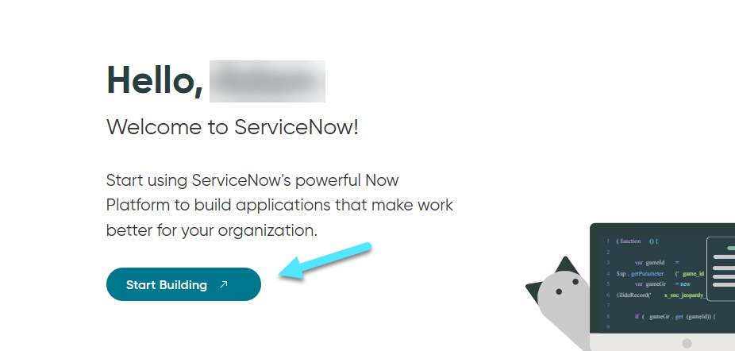

When the instance creation is complete, ServiceNow will show you the admin login and password. Make sure to save these for future reference. In addition, ServiceNow will reclaim developer instances after they are inactive for a certain number of days - 10 days at the time of this document's writing. Keep this in mind as you will need to install ServiceNow Event Management each time you are required to make a new ServiceNow instance.

Login to your ServiceNow instance. In the upper left corner is the navigation menu. Select "All" from the navigation menu, search "applications", and select "All", which is a sub-menu of "All Available Applicaions". This will load up the ServiceNow store, where you can obtain the Event Management application.

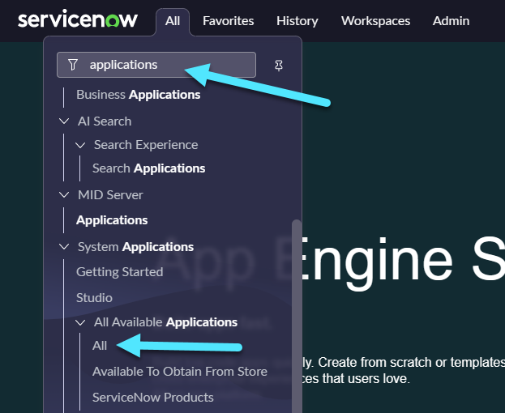

When the store loads, search "Event Management Connectors." Select the "Install" button for the Event Management Connectors product. The installation can take 10-20 minutes. Begin the Azure configuration while this installation proceeds.

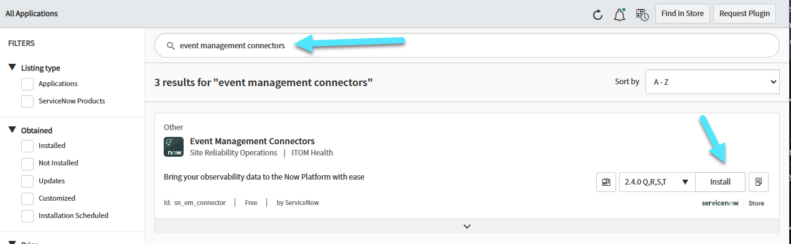

## Azure Setup

Azure will communicate with ServiceNow via Secure Webhook, an updated version of the [IT Service Management Connector (ITSMC)](https://learn.microsoft.com/en-us/azure/azure-monitor/alerts/itsmc-overview). Both solutions allow you to create work items in an ITSM tool, like ServiceNow, when Azure Monitor sends alerts. However, ITSMC uses usernames and passwords for authentication. Secure Webhook leverages Azure Active Directory (Azure AD), a stronger authentication process, with OAuth v1 or v2. This demonstration uses v2.

There is an excellent overview of the Secure Webhook data flow for Azure Monitor [here](https://learn.microsoft.com/en-us/azure/azure-monitor/alerts/it-service-management-connector-secure-webhook-connections#secure-webhook-data-flow).

The flow is as follows:

1. An Azure Alert fires, which triggers the Secure Webhook action within the Azure Action Group.
2. The alert payload is sent to ServiceNow via the Secure Webhook.
3. When the alert is received, ServiceNow reaches back to your Azure tenant's Azure AD instance to check if the alert is authorized to be consumed by ServiceNow. Note, this is the important difference between ITSMC and Secure Webhook. With ITSMC, a username and password are sent to ServiceNow and ServiceNow either accepts or rejects the password. It does not communicate back to Azure AD.
4. If the alert is authorized, the application:
    1. Creates a work item, such as an alert or incident, in ServiceNow.
    2. Binds the ID of the configuration item (CI) to the customer management database (CMBD) in ServiceNow.

The Secure Webhook has many benefits, but the most notable are that

- Azure AD is used for authentication between Azure and ServiceNow.
- Metric alerts exist in a "fired" and "resolved" state. An alert is fired when a condition is met and resolved when that condition is no longer met. With ITSMC, alerts can't be automatically resolved. With Secure Webhook, the resolved state flows to ServiceNow and is updated automatically.
- Secure Webhook utilizes a [common alert schema](https://learn.microsoft.com/en-us/azure/azure-monitor/alerts/alerts-common-schema) for all alert types. This means all alert types will be able to bind their configuration item with the CMDB. With ITSMC, the alert payload schema is different for each alert type.

To implement a Secure Webhook, we need access to Azure AD. Login to the [Azure Portal](https://portal.azure.com) and navigate to Azure Active Directory. Select "App registrations" on the far left and then "New Registration."

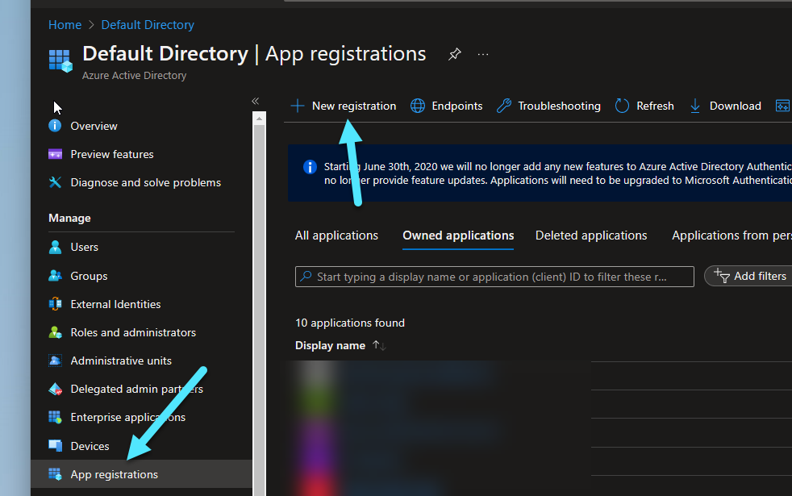

On the "Regster an application" page, create a friendly name, such as "ServiceNow Integration", set Supported account types to "Accounts in this organizational directory only", and select "Register." Leave "Redirect URI" blank.

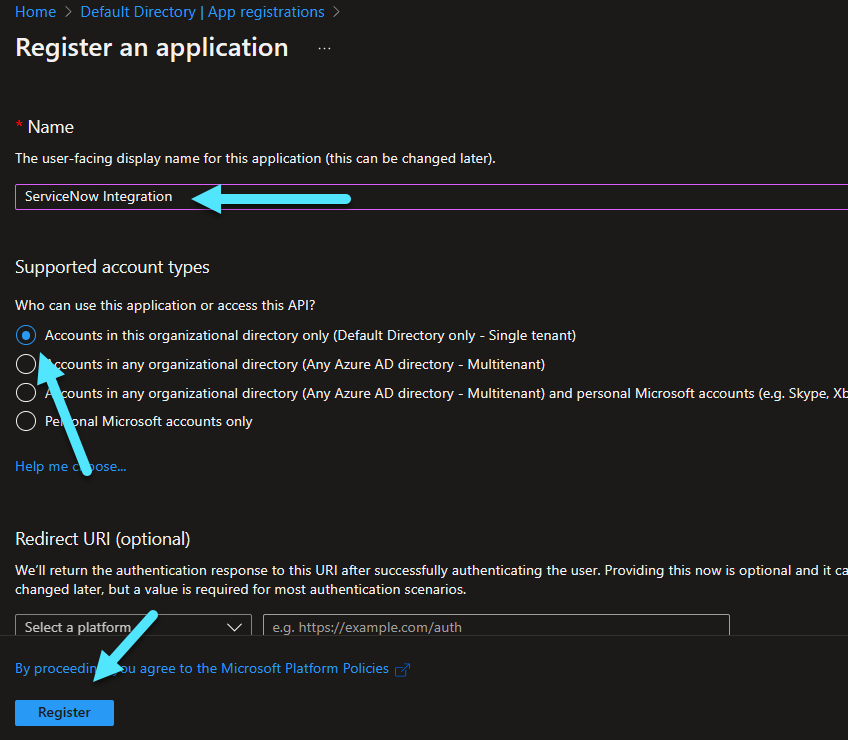

Once the new app registraiton completes, select "Expose an API" from the far left. Then, select "Set" next to "Application ID URI" and save the changes. The Application ID URI will change to a value similar to "api://a234asdf-234-asd4-asdf-a34asdf".

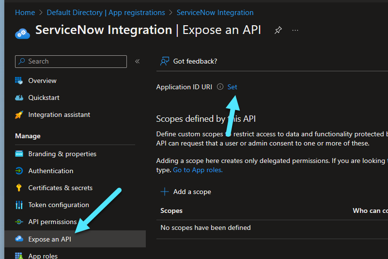

On the same screen, select "Manifest" from the far left, find "accessTokenAcceptedVersion", change the value to "2" by editing it directly in the screen, and then save the change. This will set authentication to use OAuth v2 tokens.

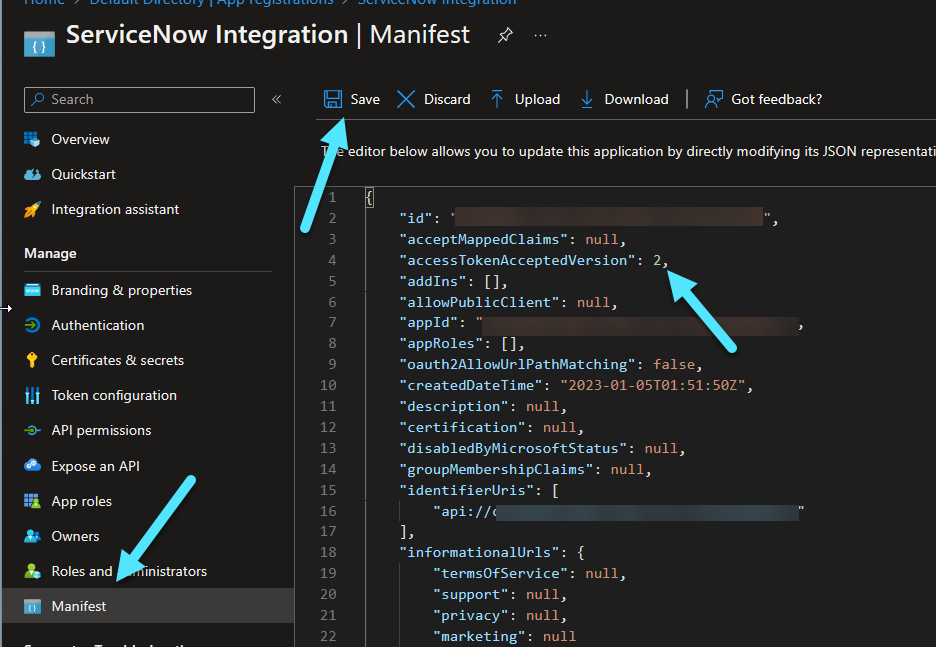

As a final step, you will need to execute the [SecureWebhook.ps1](./SecureWebhook.ps1) PowerShell script. The code is a modification of the [Secure webhook PowerShell script](https://learn.microsoft.com/en-us/azure/azure-monitor/alerts/action-groups#secure-webhook-powershell-script) from Microsoft. The primary difference is this script uses the Az.Resource module instead of the AzureAD module.

The script requires tenant admin privileges. Reading through the script will help you better understand the nuance of the Secure Webhook authentication.

In short, the script does the following:
1. Gets the newly created app registration, which we named "ServiceNow Integration" see if the "ActionGroupsSecureWebhook" app role is associated with it. If the app role isn't found, add it to the "ServiceNow Integration" app. This process will expose application permissions by setting the Allow Member Type to "Application". This means services and daemons, such as the communication between Azure and ServiceNow, will be able to authenticate. This is as opposed to users, which can require an interactive consent to authenticate.
2. Check to see if the "AzNS AAD Webhook" Service Principal exists in the Azure Tenant. This Service Principal is used by Azure to authenticate to the protected API and needs to be added a a member of a role on the target AAD application - ServiceNow Integration - that grants access to the target endpoint. 
3. Assign the "AzNS AAD Webhook" service principal to the "ActionGroupSecureWebhook" app role on the "ServiceNow Integration" app registration that exposes the API. 

To run the [SecureWebhook.ps1](./SecureWebhook.ps1) script, you must have the following:
1. Tenent admin access to create and assign app roles.
2. The object ID of your "ServiceNow Integration" app. This is **not** the application ID. The object ID is below the application ID on the app registration page for the "ServiceNow Integration" app registration as shown in the image below. Set the $myAzureADApplicationObjectId variable equal to your app's object ID. This is around line 9 in the [SecureWebhook.ps1](./SecureWebhook.ps1) script.

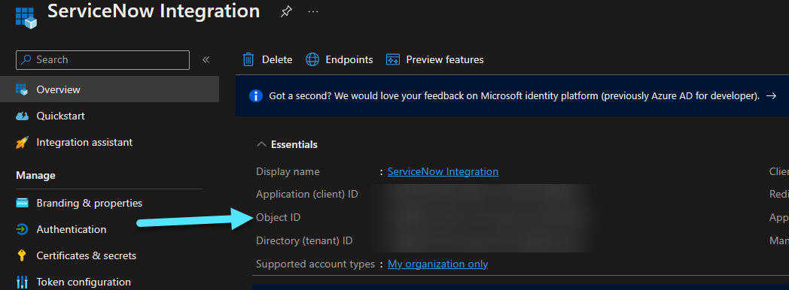

Run the script.

When the script completes, navigate to your ServiceNow Integration app registration, select "App roles" from the far left, and you should see "ActionGroupsSecureWebhook" associated.

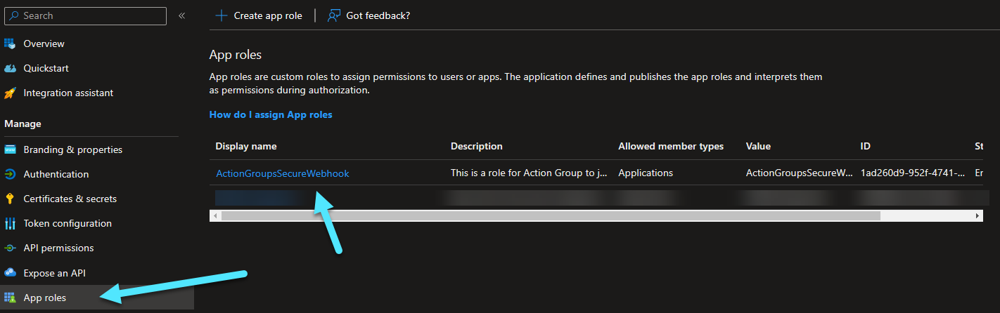

## Configure ServiceNow for Authentication

At this point, the Event Management connector started in the [Create a ServiceNow Developer Account](#create-a-servicenow-developer-account) section should be complete. Log back into your ServiceNow instance, select "All" from the toolbar, type "Users", and select "Users" under "Users and Groups".

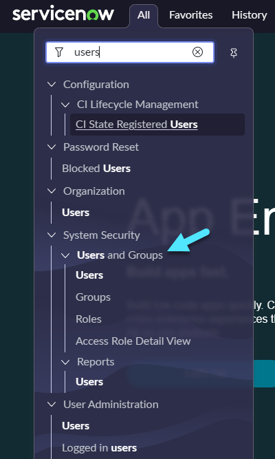

We will now assign a user with the least privileges to the "evt_mgmt_integration" role. For this, we will create a new ServiceNow user. **NOTE:** If you are a ServiceNow admin and have a different account you'd like to use, please, skip the creation of a new user and assign the "evt_mgmt_integration" role to the user you desire.

Select "New" in the upper right on the users page.

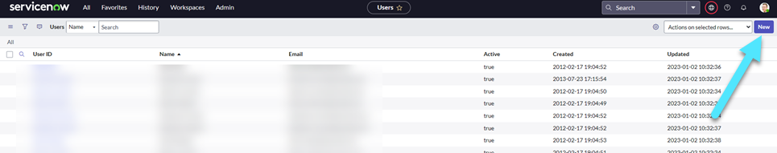

On this page, set the "User ID" to "azuremonitor" and the "Source" field to the client ID of your ServiceNow Integration app registration. Make sure the account is active. Select submit when done. If you do not see a "Source" field, see the note below.

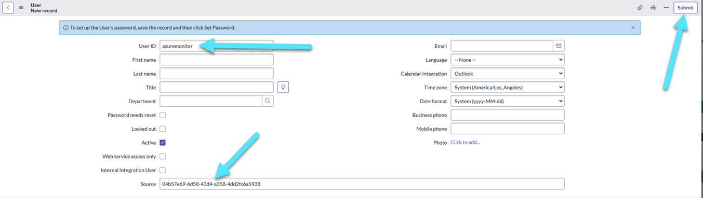

### Source Field

If you do not see the source field, select the 3 line icon on the new user page in the upper left, "Configure", then "Form Layout".

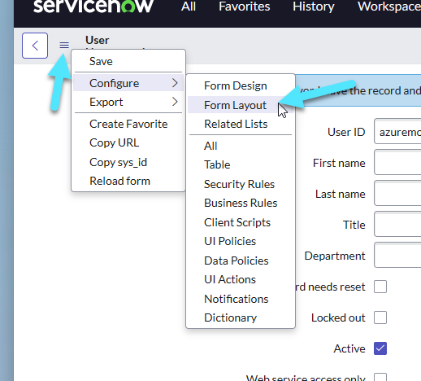

Move "Source" from the "Available" section to the "Selected" section and save. Go back and create the new user again, filling out both the user ID and source.

Once the account is created, you will be taken back to the Users list page. In the top search bar, search for Name "Azure", and select the Azure Monitor account.

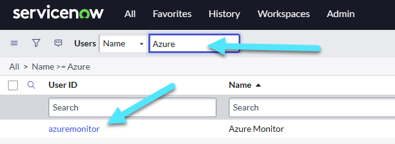

Select the "Roles" tab at the bottom of the page, select "edit", search for the "evt_mgmt_integration" role, and add it to the azuremonitor user.

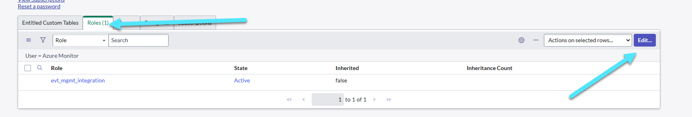

On the ServiceNow toolbar, select "All" and type "Azure OAuth Config". Select "Azure OAuth Config", which should appear under "Event Management" "Integrations".

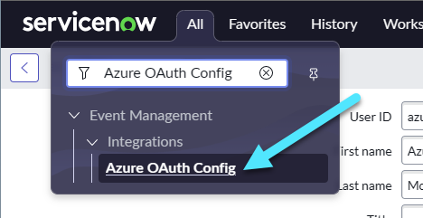

Select "Azure OAuth OIDC Entity".

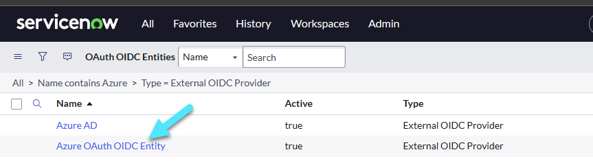

Set the Client ID value to the "ServiceNow Integration" app client ID. Do not worry about the value of Client Secret if the field is editable. Then, select the "i" icon next to "OAuth OIDC Provider Configuration".

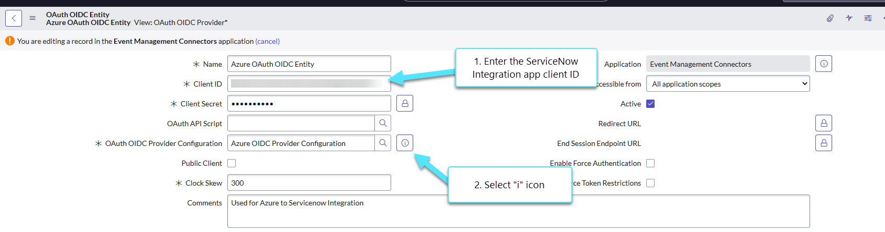

On the OIDC Provider Configuration window that appears, select "Open Record" to edit the OIDC metadata URL.

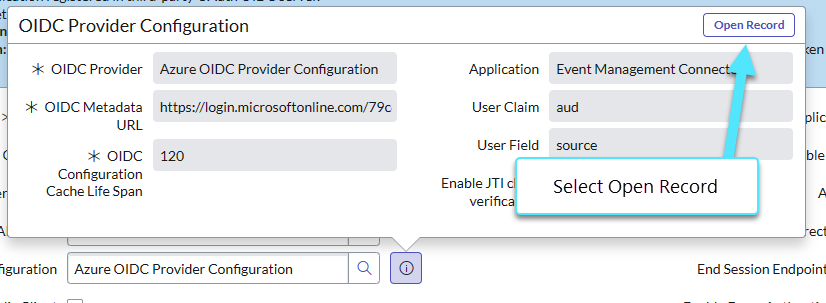

Set the OIDC Metadata URL to the value below. {tenant-id} is the tenant ID for your Azure tenant and update the record.

https://login.microsoftonline.com/{tenant-id}/v2.0/.well-known/openid-configuration

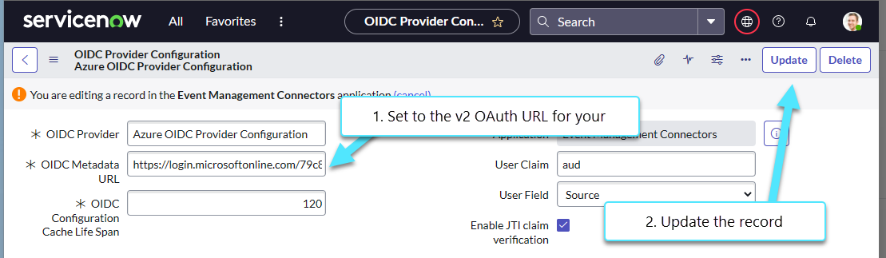

## Test Connectivity

Testing connectivity is as simple as creating an Alert Action Group in Azure and executing a test. To do so, navigate to the [Azure Portal](https://portal.azure.com), search for "Monitor", and select it.

Select "Alerts" from the far left side, then "Action Groups" from the toolbar.

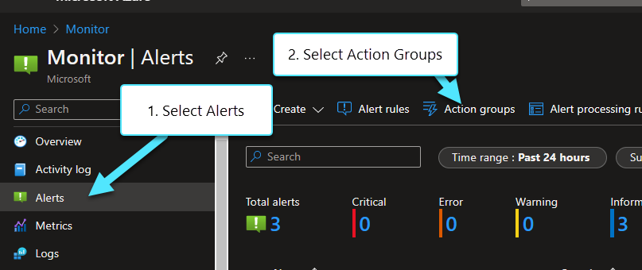

Select "Create" on the toolbar to create a new action group. Set the resource group, action group name, and display name on the subsequent page to anything you'd like. Select "Next" to move to the notifications page. Click next again, unless you want to make a notification. On the "Action" page, set the "Action type" to "Secure Webhook". This will cause a Secure Webhook configuration page to appear. Set the following values:

- Object ID: "ServiceNow Integration"
- URI: https://{instance-id}.service-now.com/api/sn_em_connector/em/inbound_event?source=azuremonitor
    - The instance-id is part of your ServiceNow instance URL. If you created a dev instance it is most likely of the form https://devXXXXX.service-now.com. devXXXXX is the instance id
- Enable the common alert schema: Yes

Click OK to save the action group. Click through the rest of the configuration to create the action group.

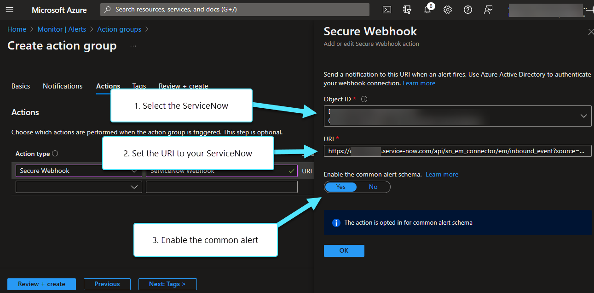

Once the action group is created, go back to the list of action groups in the Azure Portal, select the newly created action group, and select the "Test" icon on the toolbar. 

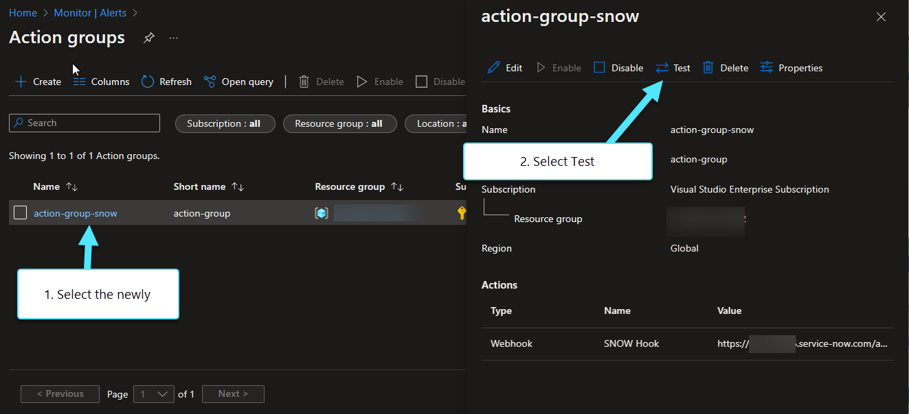

Select a sample type of test to send, the newly created secure webhook, and select the "Test" button.

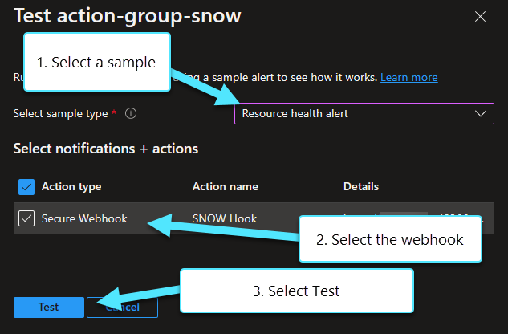

The test may take anywhere from 10 seconds to a couple minutes to run. It should report a success.

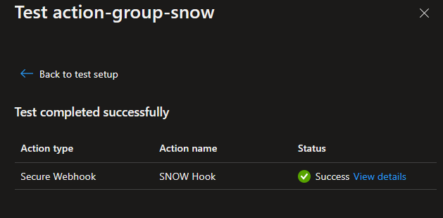

At this point, go back into your ServiceNow instance, select "All" from the toolbar, type "All Events" and select "All Events" from the resulting search.

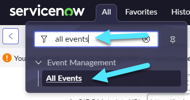

Your test alert will appear under all events. In this case, a resource health alert was sent as part of the test - it was selected as the sample type on the Azure Portal test action group page. The event is highlighted in ServiceNow below.

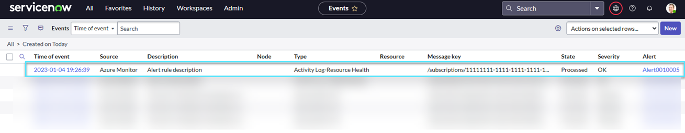

You can select the event to read all the details. At this point, communication between Azure Monitor and ServiceNow is working.

**NOTE:** If you scroll down through the event to the Processing Notes section, you may notice an error stating "No CI found for binding". Azure Monitor integration with ServiceNow relies on [Azure Cloud Discovery](https://docs.servicenow.com/bundle/rome-it-operations-management/page/product/discovery/concept/azure-cloud-discovery.html) for CI binding. In other words, ServiceNow queries Azure to get a list of the Azure resources, creates configuration items (CI) out of the resources, and binds information that comes through the alerts to the configuration items. [Azure Cloud Discovery](https://docs.servicenow.com/bundle/rome-it-operations-management/page/product/discovery/concept/azure-cloud-discovery.html) is an additional paid service that we do not setup with this demo. Thus, the error.

## References
- [Announcing New ServiceNow Event Management and Azure Monitor Integration](https://techcommunity.microsoft.com/t5/azure-observability-blog/announcing-new-servicenow-event-management-and-azure-monitor/ba-p/1870744)
- [Connect Azure to ITSM tools by using Secure Webhook](https://learn.microsoft.com/en-us/azure/azure-monitor/alerts/it-service-management-connector-secure-webhook-connections)
- [Common Alert Schema](https://learn.microsoft.com/en-us/azure/azure-monitor/alerts/alerts-common-schema)
- [ServiceNow - Integrate Azure Monitor with OAuth authentication](https://docs.servicenow.com/bundle/rome-it-operations-management/page/product/event-management/task/azure-events-authentication.html)